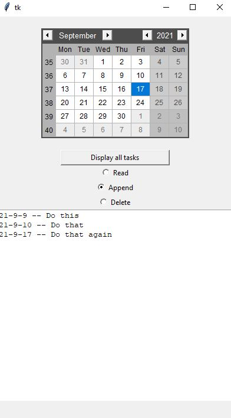

## A monza-spec To-Do App:
This is a simple python To-Do List app.  
I could not find a simple, lightweight, ad-free, free To-Do App, so created this. 
The app is simple to use, has a negligible RAM footprint, and has no ads! 
You select the date from the calender widget and can then view/append/delete tasks. Or you can view 
all your tasks across multiple days. 
Some screenshots:
